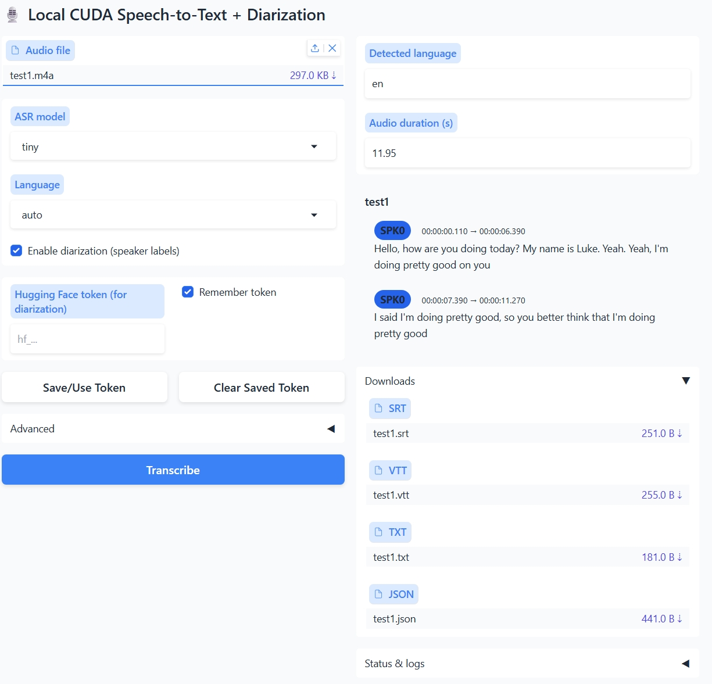

Here’s a drop-in **README.md** you can ship with your project.

---

# Transcribe App — Setup & Run (Windows, NVIDIA GPU)

This guide verifies you’re on an **NVIDIA GPU** machine and then initializes the Conda environment from `environment.yml` (named `transcribe`). An optional block shows how to install Miniconda via PowerShell if Conda isn’t installed yet.

---
## **Pre-requisites**
### Verify NVIDIA GPU + driver

Open **PowerShell** and run:

```powershell
# List graphics adapters
Get-CimInstance Win32_VideoController | Select-Object Name, DriverVersion

# If NVIDIA is present, this should work and show your GPU + driver
nvidia-smi
```

**You need:**

* An **NVIDIA GPU** listed above
* A recent **NVIDIA driver** (for CUDA 12.1 builds, driver ≥ **531.xx** is recommended)

If `nvidia-smi` isn’t found, install/update the NVIDIA driver from GeForce/Studio drivers (or your IT-managed image).

---

### Install Miniconda via PowerShell---***Skip if conda already installed***

If `conda` isn’t recognized:

```powershell
# Install Miniconda (64-bit) using winget
winget install -e --id Anaconda.Miniconda3

# Open a new PowerShell window (important), then initialize conda for PS:
conda init powershell

# Close and re-open PowerShell so your profile changes take effect
```

> If you cannot use winget, download Miniconda from the official site and run the installer. After installing, run `conda init powershell`, then restart PowerShell.

---

## **Setup**
### Create the environment from `environment.yml`

From the project folder (the one containing `environment.yml`):

```powershell
# Create the env (name is defined inside environment.yml) 
# (this takes about 5 minutes)
conda env create -f .\environment.yml


# (Optional) Verify torch build & CUDA availability
python -c "import torch; print('Torch:', torch.__version__, 'CUDA build:', torch.version.cuda); print('CUDA available:', torch.cuda.is_available())"
```

You should see `CUDA available: True` on a working NVIDIA machine.

---

## **Run**

From the project folder find and click `run_transcribe.bat` 

You can then make a shortcut of this file and place the shortcut on desktop or wherever.


---

# Tutorial: End-to-End Workflow

> Everything runs **locally**. Audio is processed on your machine (CUDA GPU if available, otherwise CPU).




## 1) Launch the app

Click `run_transcribe.bat` or the shortcut that you made.

The Gradio UI opens in your browser.

## 2) Pick an audio file

* Drag & drop or click **Audio file** to select a file.
* Most formats are fine (FFmpeg is used under the hood).

## 3) Choose ASR settings

* **ASR model:** `tiny`, `base`, `small`, `medium`, `large-v3`, etc.

  * Smaller = faster, larger = higher quality.
* **Language:** leave on **auto** or pick a language manually.

The app auto-detects your device:

* If a compatible NVIDIA GPU is present, it uses **CUDA (float16)**.
* Otherwise it falls back to **CPU** automatically.

## 4) (Optional) Enable diarization (speaker labels)

Diarization adds “Speaker 1 / Speaker 2 / …” labels.

Requirements (one-time):

1. Log into Hugging Face so the model can be pulled. 
   
2. Accept access on the model page (e.g., [`pyannote/speaker-diarization-3.1`](https://huggingface.co/pyannote/speaker-diarization-3.1)) in your HF account.

3. Press `Profile` → `Access Tokens` → `Create new token` → `Read` → *Name the token* → `Create token`.

4. `Copy` your new token, then on the transcription webpage, check `Enable diarization` and paste the copied token into the slot.


> Note: diarization expects **mono, 16 kHz** audio. The app will resample for you, but very noisy audio can hurt quality.

## 5) Advanced (optional)

Open **Advanced** to tweak decoding/segmentation options (chunking, timestamps, VAD/beam settings, etc.). Defaults are sensible for most cases.

## 6) Transcribe

Click **Transcribe**.

* The **Status & logs** panel shows model/device, duration, and any warnings.
* When finished, the **Downloads** list appears.

## 7) Outputs

Each run writes a per-file output folder containing:

* **SRT** – subtitles with timecodes
* **VTT** – web subtitles (YouTube, HTML5)
* **TXT** – plain text transcript
* **JSON** – structured output (segments, timestamps, language, optional speaker labels)

The app also prints the full path to the output folder in **Status & logs**.

### JSON structure (high-level)

```json
{
  "language": "en",
  "duration": 58.09,
  "segments": [
    {
      "start": 40.78,
      "end": 42.78,
      "text": "I'm worried about it.",
      "speaker": "SPEAKER_00"   // present if diarization enabled
    }
  ],
  "metadata": {
    "model": "tiny",
    "device": "cuda",
    "compute_type": "float16"
  }
}
```

---

## Troubleshooting

* **“pyannote.audio is not installed”**
  Install it and ensure PyTorch is set up:

  ```bash
  python -m pip install "pyannote.audio>=3.1"
  ```

  Also make sure you’re logged in to Hugging Face and have accepted model access.

* **Runs on CPU instead of GPU**
  Install a CUDA-enabled PyTorch wheel that matches your driver/CUDA toolkit. For example (CUDA 12.1):

  ```bash
  python -m pip install torch torchvision torchaudio --index-url https://download.pytorch.org/whl/cu121
  ```

  Then restart the app.

* **Out of memory (OOM) on large files**
  Use a smaller ASR model, lower batch sizes/chunk lengths in **Advanced**, or run on CPU if your GPU is very small.

* **FFmpeg not found**
  Install FFmpeg or let the app auto-provision (if enabled). Restart your terminal after install so PATH updates apply.


